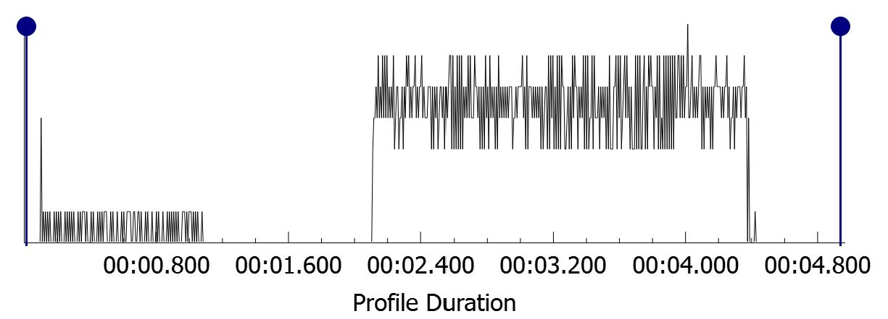

# Sequential VS Fragmented Memory Access Experiment

## outline
This is an experiment to measure the performance difference in retrieving sequential data compared to fragmented data (simulated through random indexing). 

**Note:** This test simulates realistic sequential vs. fragmented access patterns to demonstrate cache locality effects in practice, rather than measuring isolated cache-vs-RAM latency.

## Building and Running
```bash
cd CacheLocalityTest
cmake -B build -DCMAKE_BUILD_TYPE=Release
cmake --build build --config Release
```

Then run the executable from the `build/Release/` (Windows) or `build/` (Linux/Mac) directory.

**Note:** Use Release builds for accurate results.

## why?
Recently I've been developing my own Entity Component System (ECS) game engine in C++ (https://github.com/PatrickM08/3DGameEngine). ECS is the current prevailing architecture in modern game engines, valued not only for the flexibility of the component/system architecture but the performance benefits of sequential component traversal.  

In the typical ECS implementation, each component type maintains its own contiguous array containing all instances of that component. Systems can then operate on these arrays sequentially benefitting from cache locality. Cache locality refers to how modern CPUs recognize predictable access patterns (e.g. sequential or stridden patterns) and speculatively prefetch data from RAM to store it in the faster cache. 

However, I wasn’t going to take this as fact without testing it myself and therefore have created a program to test this hypothesis. Below I will outline my approach. 

## Test Implementation 

First, I timed how long it would take to access many entities (integers in this case) sequentially and then randomly. I did so by creating a test vector filled with entities (to iterate over), a vector of equal size filled with random indexes between 0 and the number of entities (this is to avoid the cost of generating a random number every loop), and a vector of sequential indexes from 0 to the number of entities (to account for the overhead caused by accessing the random vector). I set the entity count to one hundred million so that the program was substantial enough to be measured.

I created two sum variables and each iteration the integer retrieved from the test vector was added to its respective sum. This sum is output at the end of the program, if it isn’t the compiler completely optimizes away the loops! This is due to “dead code elimination” a compiler optimization trick that removes code that doesn't affect the program’s output.

I used std::chrono::steady_clock to measure how long each loop took. Now that everything was in place we can run our tests and retrieve our times: 

- Sequential milliseconds: 22ms  
- Random milliseconds: 417ms  

Results may vary based on your CPU, however the difference is definitely significant (19x)! But how can we be sure that this disparity is caused by cache misses? For that we will need to profile.

## Profiling 

There are a variety of different profilers that can access some form of cache behaviour information. The profiler you pick will heavily depend on your system, as I am on Windows and have an AMD CPU, I used AMD uProf.  

I altered my program to access the test vector directly using the loop index for sequential access and generating the random number per loop for random access. This is okay now because we are looking at cache information rather than measuring time taken. We also do not want any excess memory retrievals. I also added a one second sleep in between the two loops so we can see the difference on the graphs clearly. 

I profiled my program using uProf’s “Investigate Data Access” config, this allowed me to see the L1_DEMAND_DC_REFILLS_LOCAL_ DRAM event over the time of the program. AMD describes this cache event as follows: The demand Data Cache (DC) fills from DRAM or IO connected in the same package (node). This is more simply defined as the number of times there is a cache miss in the L1 cache that results in the CPU having to fetch memory from main memory instead.  

So, if the performance decrease is truly caused by cache misses, we should see significantly more fetches for random access. Which is exactly what we can see: 

 

We can see that random access results in a huge amount of cache misses relative to sequential access which can be seen on the left of the graph. However, sequential access does still have uniform peaks, this is when the program reaches the end of the cache lines stored in cache and must fetch more data from main memory. 

## Conclusion 

This is obviously the worst-case scenario. Completely random access over one hundred million entities is not typical for any game or program. However, this experiment does show that there are performance benefits to data-oriented design that should not be ignored. 

Thank you for reading.
